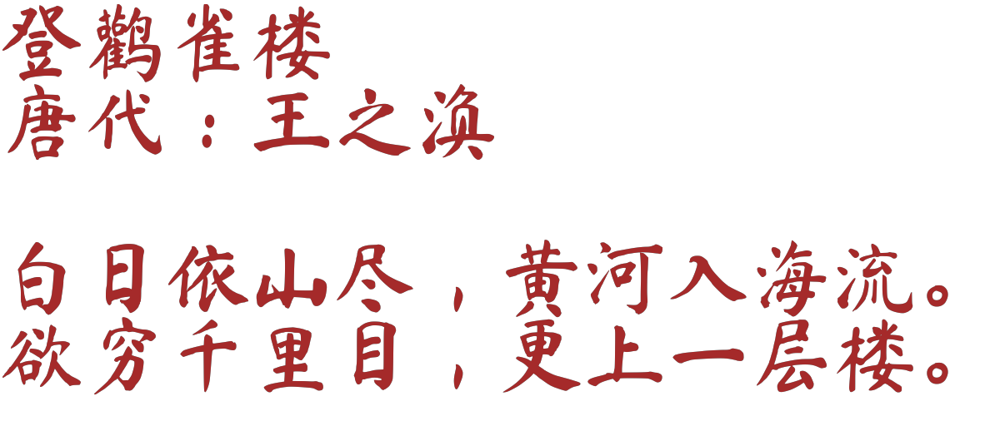

# Texttoimage

Texttoimage is a Python library for converting text to a transparent image.

## Installation

Use the package manager [pip](https://pip.pypa.io/en/stable/) to install texttoimage.

```bash
pip install texttoimage
```

## Usage

```python
import texttoimage

texttoimage.convert('Hello World') # generate an image named "helloworld.png"

# if you want to create a multiple line text image you can use `\n` in your text
text = 'Hello World\n This is a multiple line text'
# It'll generate an image which the font size is 48 and color is red.
texttoimage.convert(text, image_file='test.png', font_size=100, color='red')
```

If you want to use Chinese you can download or tell the convert function a font which can support Chinese.
For example I download a font from google fonts named `MaShanZheng-Regular.ttf`, now I can run the code like this:
```python
import texttoimage

texttoimage.convert('你好啊', font_name='MaShanZheng-Regular.ttf', font_size=100, color='green')
```
Then I got this png file.

Another Chinese with multiple lines:

```python
import texttoimage
poem = '''登鹳雀楼
唐代：王之涣

白日依山尽，黄河入海流。
欲穷千里目，更上一层楼。'''
texttoimage.convert(poem, image_file='poem.png', font_name='MaShanZheng-Regular.ttf', font_size=100, color='brown')
```

## Examples




## Contributing
Pull requests are welcome. For major changes, please open an issue first to discuss what you would like to change.

Please make sure to update tests as appropriate.

## License
[MIT](https://choosealicense.com/licenses/mit/)
